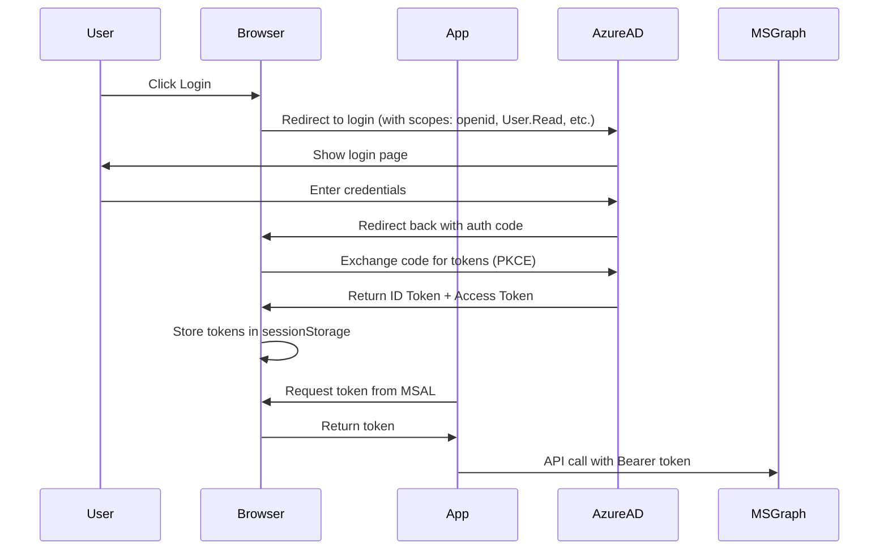

# Token Security Clarification

**Question:** "You're using `openid` scope - does that mean ID tokens are in your codebase?"

**Answer:** **NO.** The `openid` scope does NOT mean tokens are hardcoded or exposed in the codebase.

---

## What is the `openid` Scope?

The `openid` scope is a **standard OAuth 2.0 / OpenID Connect scope** that tells Azure AD:

> "This application wants to use OpenID Connect authentication and receive an ID token"

**It's required for:**
- Authenticating users with Azure AD
- Receiving basic identity information (user ID, name, email)
- Getting ID tokens during the login flow

**It does NOT mean:**
- ❌ Tokens are stored in your source code
- ❌ Tokens are hardcoded anywhere
- ❌ Tokens are exposed to the public

---

## How Tokens Work in Your App

### 1. **No Tokens in Source Code** ✅

Confirmed by code analysis:
- ❌ No hardcoded access tokens
- ❌ No hardcoded ID tokens
- ❌ No Bearer tokens in files
- ❌ No tokens in environment variables
- ✅ Tokens are obtained dynamically at runtime

### 2. **Token Storage** 🔒

From `src/auth/authConfig.js`:
```javascript
cache: {
  cacheLocation: "sessionStorage",  // Tokens stored in browser sessionStorage
  storeAuthStateInCookie: false,
}
```

**Where tokens are stored:**
- In the **user's browser** sessionStorage (client-side only)
- Cleared when browser tab/window is closed
- Never sent to your server
- Never committed to git

### 3. **Token Acquisition Flow**



### 4. **How Your App Gets Tokens**

From `src/auth/useTokens.js`:
```javascript
// Token is requested from MSAL at runtime
const getToken = async () => {
  const account = instance.getActiveAccount();
  const result = await instance.acquireTokenSilent({
    scopes: ["User.Read"],
    account: account,
  });
  return result.accessToken;  // Dynamically obtained, never hardcoded
};
```

**Process:**
1. User logs in → Azure AD issues tokens
2. MSAL library stores tokens in sessionStorage
3. When app needs a token, it calls `getToken()`
4. MSAL retrieves token from sessionStorage (or refreshes if expired)
5. Token is used in API call: `Authorization: Bearer <token>`
6. Token is never saved to disk or source code

---

## What Scopes Mean

From `src/auth/authConfig.js`:

```javascript
scopes: ["User.Read", "profile", "openid", "email", "Calendars.ReadWrite"]
```

| Scope | What It Means | Where Tokens Go |
|-------|---------------|-----------------|
| **openid** | Enable OpenID Connect authentication | ID token to browser sessionStorage |
| **profile** | Request basic profile info in ID token | Claims in ID token |
| **email** | Request email address in ID token | Claims in ID token |
| **User.Read** | Permission to call Microsoft Graph `/me` endpoint | Access token to browser sessionStorage |
| **Calendars.ReadWrite** | Permission to read/write user's calendar | Access token to browser sessionStorage |

**All tokens:**
- ✅ Stored in browser sessionStorage
- ✅ Obtained dynamically at runtime
- ✅ Automatically refreshed by MSAL
- ✅ Cleared on logout
- ❌ Never in source code
- ❌ Never committed to git

---

## Security Best Practices ✅ (Already Implemented)

### 1. **Token Storage**
- ✅ Using `sessionStorage` (cleared on browser close)
- ✅ NOT using `localStorage` (persists longer)
- ✅ NOT using cookies for tokens

### 2. **Token Transmission**
- ✅ HTTPS only (enforced by Azure Static Web Apps)
- ✅ Tokens sent in Authorization header (not URL params)
- ✅ PKCE enabled for SPA (no client secrets needed)

### 3. **Source Code**
- ✅ No tokens hardcoded
- ✅ No secrets in environment variables
- ✅ `.env` files in `.gitignore`

### 4. **Token Refresh**
- ✅ MSAL handles automatic refresh
- ✅ Silent token acquisition (no user prompt)
- ✅ Expired tokens automatically renewed

---

## What's Actually in Your Codebase

### Environment Variables (`.env.local`)
```env
VITE_AZURE_CLIENT_ID=ebe60b7a-93c9-4b12-8375-4ab3181000e8  # ✅ PUBLIC (client ID, not secret)
VITE_AZURE_TENANT_ID=fe3fb5c4-c612-405e-bee1-60ba20a1bdff  # ✅ PUBLIC (tenant ID)
VITE_APP_ENV=development                                   # ✅ PUBLIC
```

**These are NOT secrets:**
- Client ID is public (like a username for your app)
- Tenant ID is public (identifies your Azure AD)
- Both are safe to expose in client-side code

**What's NOT in your codebase:**
- ❌ Client secrets (SPA doesn't use them)
- ❌ Access tokens
- ❌ ID tokens
- ❌ Refresh tokens
- ❌ API keys (Cosmos, OpenAI, etc. - those are backend-only)

---

## Response to "Show Me Your ID Tokens"

### Polite Response:

> "We don't store ID tokens in our codebase. They're dynamically generated by Azure AD when users log in and stored only in the user's browser session. The `openid` scope is a standard OAuth/OIDC scope required for authentication - it doesn't mean tokens are exposed.
>
> Our app follows Microsoft's recommended security practices for Single-Page Applications:
> - Tokens are obtained at runtime via MSAL
> - Stored in browser sessionStorage (not source code)
> - Transmitted over HTTPS only
> - Automatically refreshed by MSAL
>
> What you see in our Azure AD app registration configuration are the **permission scopes** we request, not actual tokens. The actual tokens are never stored in our repository."

### What They Can See (Public Info):

1. **App Registration Configuration** (from Azure portal or CLI):
   - Client ID: `ebe60b7a-93c9-4b12-8375-4ab3181000e8`
   - Tenant ID: `fe3fb5c4-c612-405e-bee1-60ba20a1bdff`
   - Scopes requested: `openid, profile, email, User.Read, Calendars.ReadWrite`
   - Redirect URIs
   - Sign-in audience

2. **Sample ID Token Claims** (what's in a token after login):
   ```json
   {
     "aud": "ebe60b7a-93c9-4b12-8375-4ab3181000e8",
     "iss": "https://login.microsoftonline.com/fe3fb5c4-c612-405e-bee1-60ba20a1bdff/v2.0",
     "iat": 1234567890,
     "exp": 1234571490,
     "name": "John Doe",
     "preferred_username": "john.doe@netsurit.com",
     "oid": "00000000-0000-0000-0000-000000000000",
     "tid": "fe3fb5c4-c612-405e-bee1-60ba20a1bdff",
     "roles": ["DreamSpace.Admin"]
   }
   ```

These are **after login** and only visible to the logged-in user in their own browser.

### What They CANNOT See:

- ❌ Actual access tokens from your users
- ❌ Actual ID tokens from your users
- ❌ Any user's authentication state
- ❌ Backend API keys (Cosmos, OpenAI, etc.)

---

## Summary

**The `openid` scope is NOT a security issue.**

It's a standard, required scope for modern authentication. It does NOT mean tokens are exposed in your codebase.

**Your implementation is secure:**
- ✅ No tokens in source code
- ✅ Tokens stored client-side only
- ✅ PKCE for secure SPA authentication
- ✅ HTTPS everywhere
- ✅ Follows Microsoft best practices

**If someone asks for "your ID tokens":**
They may be confusing scopes with actual tokens. The configuration is public (and necessary for the app to work), but actual tokens are never exposed.
